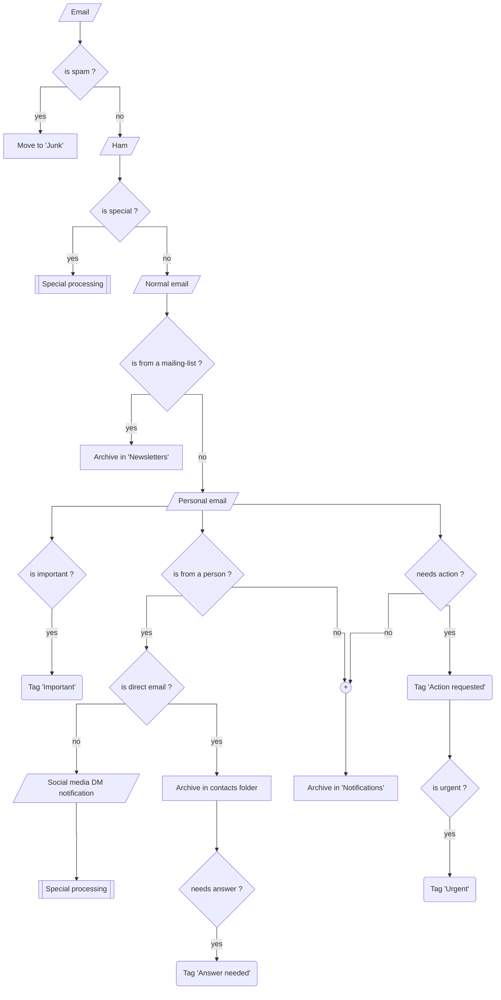

# Proposed workflow

*Virtual Secretary* interconnects emails with other services, like calendars and address books, to trigger automatic responses (workflows) and sorting (filters). Since services are typically already able to send emails, the direction `services -> emails` is not handled by *Virtual Secretary*, which will focus on the missing direction `emails -> services`.

# Structure of email addresses

It is better to try and keep different people and services on different email accounts. *Virtual Secretary* can process different email addresses in sequence, and you don't even have to duplicate the filters if you put them in the `common` subfolder of your `config` directory. Different email accounts can also share a single address book.

Here are a couple of suggested emails to divide your email input:

* __me@me.com__: your personal email, the one you give to friends and family, that you may sync with your smartphone,
* __pro@me.com__: your professional email, the one you give to colleagues and collaborators, that you will not open on holidays and probably not sync on your personal devices, or at least not after  8 PM and on week-ends,
* __banks@me.com__: your secure email, that you will give **only** to your trusted banks, insurances companies, revenue agencies etc.
* __spam@me.com__: your unsecure email, that you will use on every semi-shady website or platform that may sell it and leak it in their next security breach to spammers,
* __suppliers@me.com__: the email you give to companies and people that sell you stuff,
* __clients@me.com__: the email you give to companies and people you sell stuff to.
* __contact@me.com__: the email people you don't know will use to contact you.

The point of splitting matters between emails like this is mostly to spot phishing emails, trying to impersonate organizations and companies to steal your logins/passwords/money. If you get an invoice (or worse: a debt settling notice) on any other email than __suppliers@me.com__ or a bank security alert on any other email than __banks@me.com__, you don't need to think twice: these are phishing attempts.

For each of these emails, you should subscribe to [Firefox Monitor](https://monitor.firefox.com/) and [Have I been pwnd ?](https://haveibeenpwned.com/DomainSearch) alerts to get notified if they are found in a data breach and take appropriate measures.

# General principles

There are mostly 3 types of emails:

1. emails sent to you by persons,
2. emails sent to you by automated systems (newsletters, notifications, invoices, etc.),
3. emails sent to you by automated systems but originating from persons, like notifications of direct messages on social platforms or notifications of new replies on forums and chats.

Those emails will trigger 4 different actions:

1. urgent action,
2. delayed action,
3. acknowledge info,
4. ignore.

But those actions can all result from the 3 different types of emails, like automated emails notifying you of account password reset or new suspicious activity on your account typically require urgent action.

Now, the overwhelming of modern life is we have limited time to process all these emails, which get received as a mixed pack, and we don't have secretaries anymore to handle them. So the whole idea is to use data contained within the emails but also from other sources to guess if each email require action, when, and deliver that to the user as a pre-digested queue.

Our goal will be to achieve all operations in square boxes automatically, and as many operations in rounded boxes as possible, using filters.

Special processing will be needed at 2 places.

At the beginning, special emails could be anything related to bank accounts and security, taxes and revenues agencies, social and health insurances, etc. Those emails are both very important and easy to filter, for example, in France, any email sent by an address ending in `impots.gouv.fr` or `finances.gouv.fr` has something to do with taxes. Taking care of these emails with simple filters at the beginning of the process will remove the probability of false negatives and prevent losses of information that we can't afford on such topics.

At the end, for emails sent by people, special processing may aim at reconstructing an email thread from notifications of direct messages on social media. Social media DM are essentially emails but captured on a third-party platform that badly wants you to spend time on said platform to generate advertising revenues. Problem is they scatter your communication and people really want to keep using them because the UI/UX/ergonomy of most social media messenger apps are much better and more fun than your average mobile email client. But the emails notifications of DM are technically emails sent by bots but they represent a real human communication and are a grey area in-between.

You may want to manage your social accounts from your mailbox as much as possible, for efficiency but also for archival. Some social media embed the content of the DM into the email notifications. In that case, you may want to move the notifications emails in contact-based archives, along with the other messages (emails or other social media messages) you exchanged with the same person. Ultimately, you may want to answer DM directly by replying to the notification email, which is possible on a few platforms like Discourse and Github.
